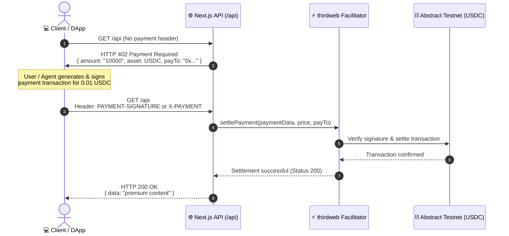

<div align="center">

# ⚡ x402-paywall

**Next.js 16 + Turborepo Monorepo implementing the HTTP 402 (Payment Required) standard using thirdweb x402 on Abstract Testnet.**

[](https://nextjs.org/)
[](https://react.dev/)
[](https://thirdweb.com/)
[](https://abstract.run/)
[](https://turbo.build/)
[](https://pnpm.io/)
[](https://www.typescriptlang.org/)
[](LICENSE)

</div>

---

## 📖 Overview

**x402-paywall** is a reference architecture and starter kit for building monetized web APIs and paywalled content using the native **HTTP 402 (Payment Required)** status code.

Instead of requiring user accounts, Stripe subscriptions, or traditional payment gateways, this middleware enables **frictionless, programmatic crypto micropayments**. When an unpaid client requests a protected endpoint, the server responds with a standard `402 Payment Required` challenge containing payment terms (network, token, amount, recipient). Once the client signs and submits the payment payload, the middleware settles the transaction on-chain via the **thirdweb x402 facilitator** and unlocks the resource.

### 🌟 Key Features

- 🔒 **HTTP 402 Native Protocol**: Fully compliant with the Web3 HTTP 402 standard for programmatic payments.
- ⚡ **Zero-Friction Micropayments**: Settle instant on-chain micropayments (preconfigured with **0.01 USDC** on **Abstract Testnet**).
- 🛡️ **thirdweb Facilitator Integration**: Streamlined server-side verification and settlement using `@thirdweb/x402`.
- 🏗️ **Modern Turborepo Monorepo**: Scalable workspace architecture with Next.js 16 (React 19), Tailwind CSS v4, shared TypeScript, ESLint, and UI component packages.
- 🎨 **Shared UI Package**: Includes shadcn-style component library (`@workspace/ui`) with dark mode support via `next-themes`.

---

## 🔄 How It Works



---

## 📁 Repository Structure

```tree
x402-paywall/
├── apps/
│   └── web/                   # Next.js 16 App Router application
│       ├── app/
│       │   ├── api/
│       │   │   └── route.ts   # x402 protected API endpoint with thirdweb settlement
│       │   ├── layout.tsx     # Root layout with ThemeProvider and font setup
│       │   └── page.tsx       # Landing page consuming @workspace/ui
│       ├── next.config.ts     # Config with root monorepo .env loader
│       └── package.json
├── packages/
│   ├── ui/                    # Shared Tailwind CSS / Base UI component library
│   ├── eslint-config/         # Shared ESLint configuration
│   └── typescript-config/     # Shared tsconfig bases
├── .env.example               # Root environment variables template
├── package.json               # Root monorepo configuration
├── pnpm-workspace.yaml        # pnpm workspace definition
└── turbo.json                 # Turborepo pipeline configuration
```

---

## 🚀 Quick Start

### Prerequisites

- **Node.js**: `v20.0.0` or higher
- **pnpm**: `v9` or `v10` (`corepack enable && corepack prepare pnpm@latest --activate`)
- **thirdweb API Key**: Create a free API key at [thirdweb.com/create-api-key](https://thirdweb.com/create-api-key).
- **Server Wallet**: An EVM wallet address to receive payments.

### 1. Clone & Install Dependencies

```bash
git clone https://github.com/PradyunKedia/X402-Basic.git
cd X402-Basic
pnpm install
```

### 2. Configure Environment Variables

Copy the `.env.example` template to `.env.local`:

```bash
cp .env.example .env.local
```

Open `.env.local` and add your thirdweb credentials:

```env
# Server-only thirdweb credentials (never expose to client-side bundles)
THIRDWEB_SECRET_KEY=your_thirdweb_secret_key_here
THIRDWEB_SERVER_WALLET_ADDRESS=0xYourServerWalletAddressHere
```

> [!NOTE]
> The Next.js configuration (`apps/web/next.config.ts`) automatically loads environment variables from both `apps/web/.env.local` and the root `.env.local`.

### 3. Run the Development Server

```bash
pnpm dev
```

The application will start on **[http://localhost:3000](http://localhost:3000)**.

---

## 🧪 Testing the x402 Paywall

### 1. Unauthenticated Request (Receive 402 Challenge)

Send a `GET` request to the API without any payment headers:

```bash
curl -i http://localhost:3000/api
```

**Expected Response (`HTTP 402 Payment Required`):**

```http
HTTP/1.1 402 Payment Required
Content-Type: application/json

{
  "error": "Payment Required",
  "payTo": "0xYourServerWalletAddress",
  "price": {
    "amount": "10000",
    "asset": {
      "address": "0xe4C7fBB0a626ed208021ccabA6Be1566905E2dFc",
      "decimals": 6
    }
  },
  "network": "abstract-testnet"
}
```

### 2. Authenticated Request with Payment Signature

Once the client wallet signs the payment transaction, attach the payment header:

```bash
curl -i http://localhost:3000/api \
  -H "PAYMENT-SIGNATURE: <signed_payment_payload>"
```

**Expected Response (`HTTP 200 OK`):**

```json
{
  "data": "premium content"
}
```

---

## ⚙️ Customization & Configuration

You can easily adjust the payment requirements in [`apps/web/app/api/route.ts`](apps/web/app/api/route.ts):

```typescript
import { settlePayment, facilitator } from "thirdweb/x402";
import { abstractTestnet } from "thirdweb/chains";

const result = await settlePayment({
  resourceUrl: "http://localhost:3000/api",
  method: "GET",
  paymentData,
  payTo: setup.serverWalletAddress,
  network: abstractTestnet, // Change network (e.g. base, arbitrum, mainnet)
  price: {
    amount: "10000", // Price in smallest token unit (10000 = 0.01 USDC with 6 decimals)
    asset: {
      address: "0xe4C7fBB0a626ed208021ccabA6Be1566905E2dFc", // USDC contract address
      decimals: 6,
    },
  },
  facilitator: setup.facilitator,
});
```

---

## 🛠️ Available Scripts

Run these scripts from the repository root:

| Command | Description |
| :--- | :--- |
| `pnpm dev` | Starts all monorepo apps and packages in development mode |
| `pnpm build` | Builds all apps and packages for production |
| `pnpm lint` | Runs ESLint across all workspaces |
| `pnpm typecheck` | Validates TypeScript types across all workspaces |
| `pnpm format` | Formats codebase using Prettier |

---

## 🧰 Tech Stack

- **Framework**: [Next.js 16](https://nextjs.org/) (App Router)
- **Library**: [React 19](https://react.dev/)
- **Web3 / Payments**: [thirdweb v5 SDK](https://portal.thirdweb.com/) (`thirdweb/x402`)
- **Network**: [Abstract Testnet](https://abstract.run/)
- **Monorepo Engine**: [Turborepo](https://turbo.build/repo)
- **Styling**: [Tailwind CSS v4](https://tailwindcss.com/)
- **Theming**: [next-themes](https://github.com/pacocoursey/next-themes)
- **Package Manager**: [pnpm](https://pnpm.io/)

---

## 📄 License

This project is licensed under the [MIT License](LICENSE).
